React Bootcamp Project

This is a project I started for the Dev&Design React Bootcamp. While the assignment didn’t require making it responsive for tablets and mobile, I decided to go the extra mile!

Features

Responsive Design: Optimized for desktop, tablet, and mobile views. The tablet view was the trickiest but a great learning experience. All the buttons and links are responsive!

Detail-Oriented Styling: I focused on small UI details, playing “spot the difference” to get everything just right.

Custom Scroll Behavior: Added JavaScript so the header hides when scrolling down and reappears when scrolling up.

Mobile Menu: Fully functional and responsive.

CSS Variables: Used extensively for easier theming and consistent styling.

What I Learned

Scroll bars can actually be styled using CSS.

CSS variables are incredibly useful for large projects.

JavaScript can enhance UX even when it’s not required.

Current Status

The project is a work in progress.

I’m currently working on the second dropdown menu and would appreciate any tips or suggestions!

Screenshots
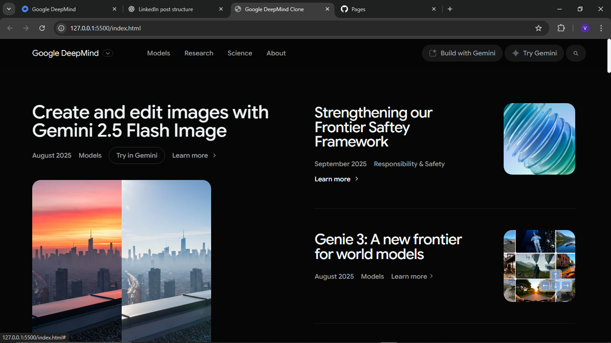
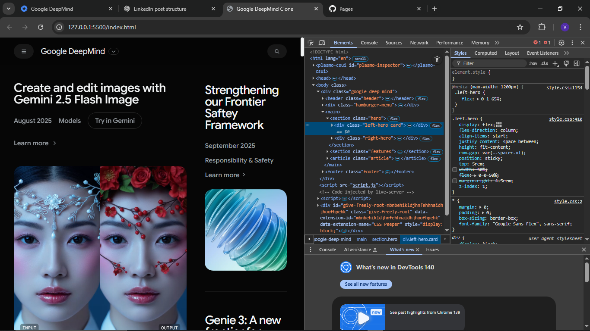
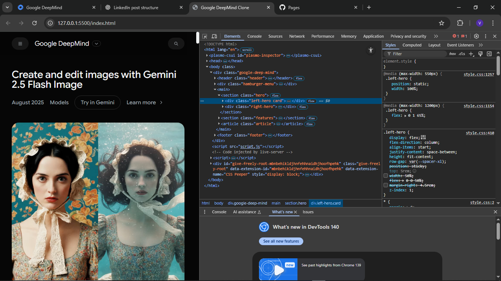
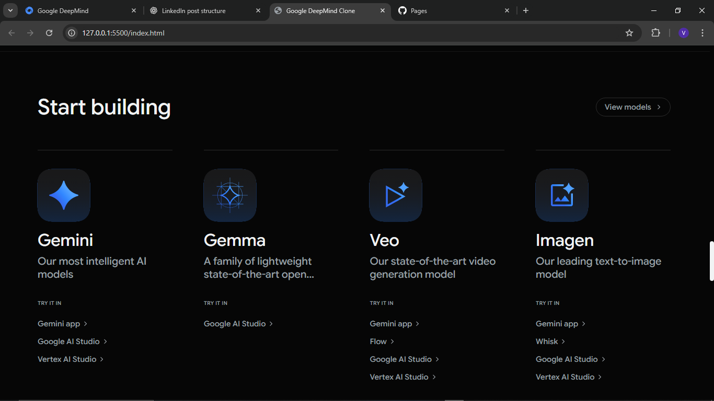
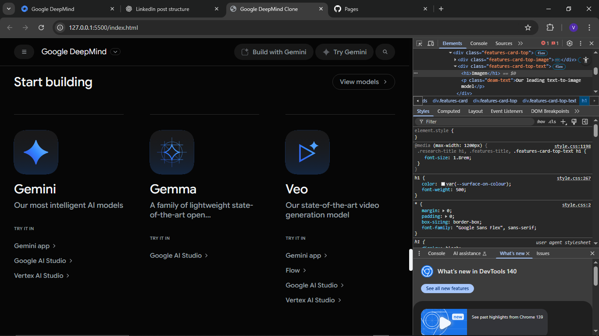
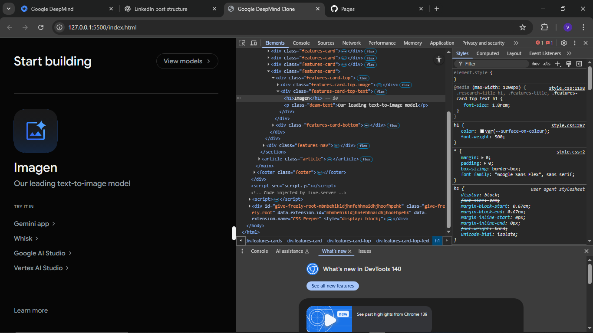
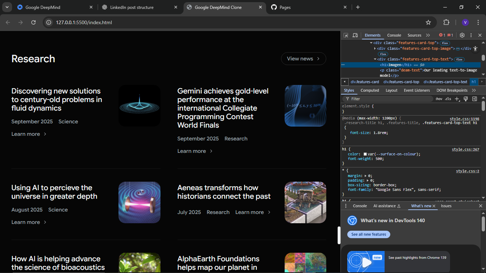
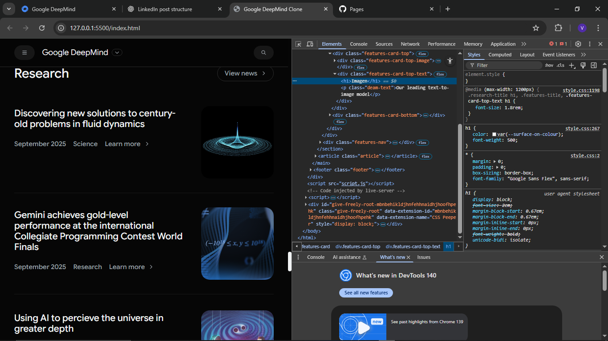
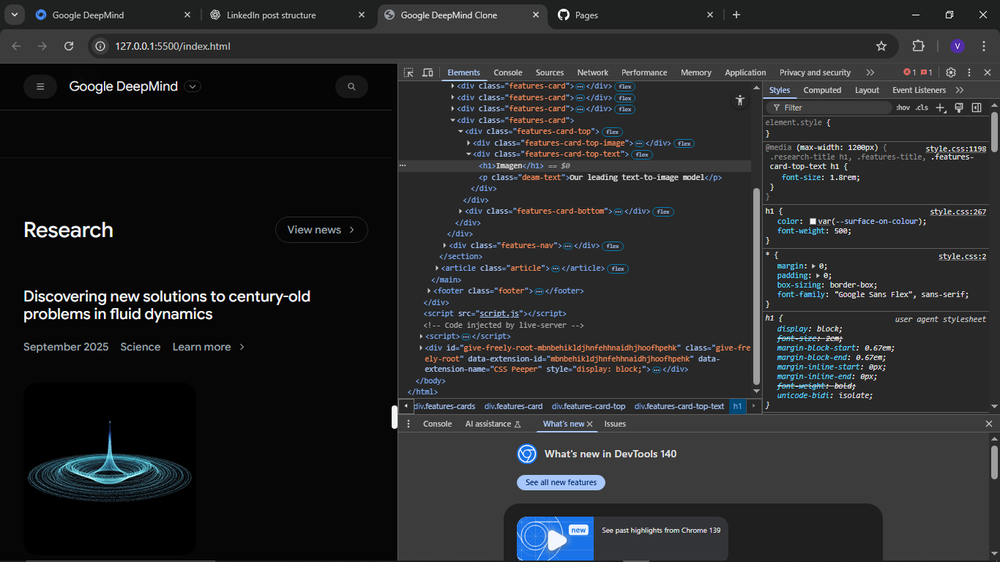
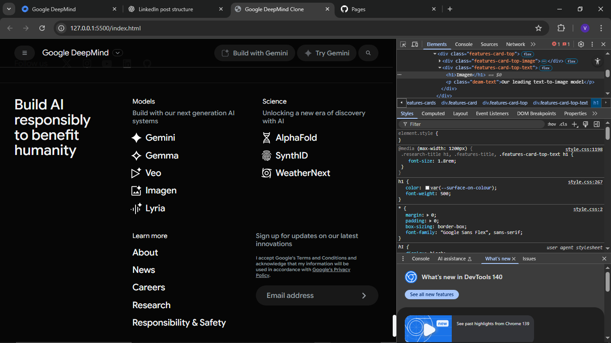
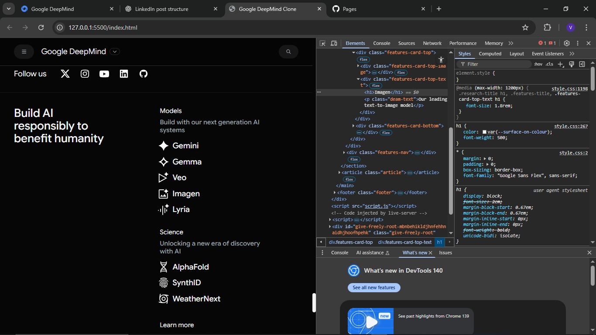
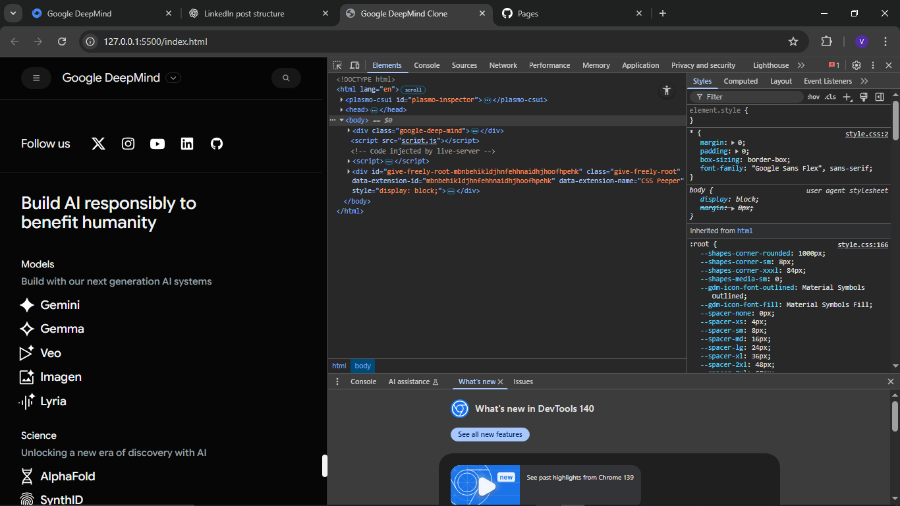
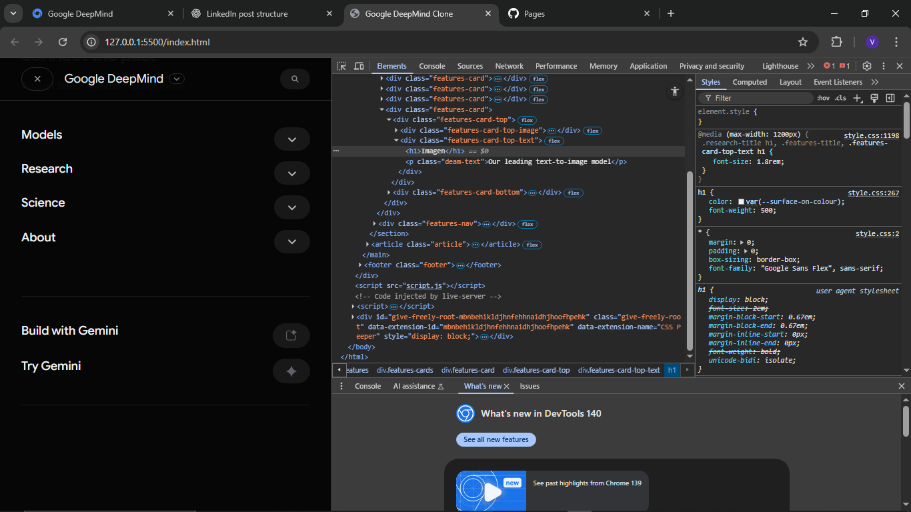

Feedback

If you have suggestions for the dropdown menu or any part of the project, feel free to comment or DM me. I’m open to ideas and improvements as I continue developing my skills.
